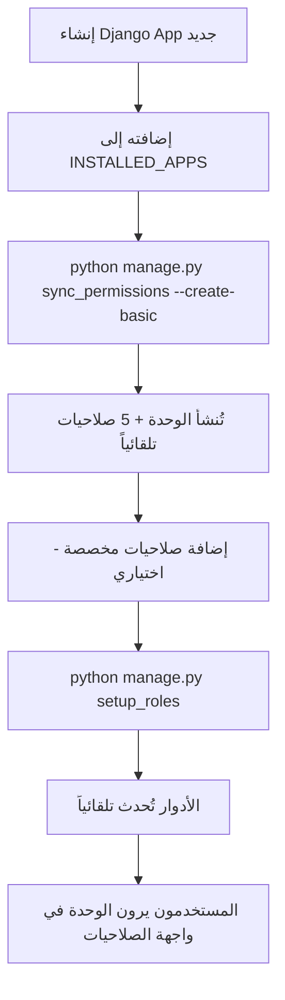

# نظام الصلاحيات الديناميكي 🔐

## نظرة عامة
نظام صلاحيات ديناميكي متقدم يتعرف تلقائياً على الوحدات (Apps) الموجودة في Django ويُنشئ الصلاحيات تلقائياً!

## المميزات الرئيسية ✨

### 1️⃣ **تسجيل الوحدات تلقائياً**
- يكتشف جميع Django Apps الموجودة تلقائياً
- يُنشئ سجل `AppModule` لكل وحدة مع الأيقونات والأسماء العربية
- يتجاهل تلقائياً apps النظام (admin, auth, rest_framework...إلخ)

### 2️⃣ **إنشاء الصلاحيات ديناميكياً**
- يُنشئ 5 صلاحيات أساسية لكل وحدة: `view`, `add`, `edit`, `delete`, `manage`
- يمكنك إضافة صلاحيات مخصصة لأي وحدة بسهولة
- الصلاحيات مرتبطة بالوحدات عبر ForeignKey (بدلاً من CharField)

### 3️⃣ **الأدوار الأربعة الأساسية**
- **الأدمن** 👑: كل الصلاحيات (57 صلاحية)
- **مدير فرع أو إدارة موظف** 👔: إدارة الفرع/القسم (11 صلاحية)
- **الموارد البشرية** 👥: إدارة الموظفين والرواتب (31 صلاحية)
- **موظف** 👤: عرض البيانات الشخصية فقط (4 صلاحيات)

### 4️⃣ **واجهة مستخدم تفاعلية**
- تبويبات ديناميكية تظهر تلقائياً حسب الوحدات الموجودة
- أيقونات Lucide مخصصة لكل وحدة
- بحث في الصلاحيات
- تحديد/إلغاء الكل لكل وحدة

---

## الإعداد الأولي 🚀

### 1️⃣ تطبيق الـ Migrations
```bash
python manage.py migrate
```

### 2️⃣ مزامنة الوحدات والصلاحيات
```bash
# تسجيل الوحدات فقط
python manage.py sync_permissions

# تسجيل الوحدات + إنشاء الصلاحيات الأساسية
python manage.py sync_permissions --create-basic
```

### 3️⃣ إنشاء الأدوار الأربعة
```bash
# إنشاء الأدوار
python manage.py setup_roles

# إعادة إنشاء الأدوار (حذف وإعادة إنشاء)
python manage.py setup_roles --reset
```

### 4️⃣ ربط المستخدمين بالأدوار
```bash
python manage.py setup_user_profiles
```

---

## إضافة وحدة جديدة 📦

### الطريقة 1: تلقائياً (موصى بها) ⚡
1. أنشئ Django app جديد:
   ```bash
   python manage.py startapp my_new_module
   ```

2. أضفه إلى `INSTALLED_APPS` في settings

3. شغّل المزامنة:
   ```bash
   python manage.py sync_permissions --create-basic
   ```

4. **تم!** ستُضاف الوحدة تلقائياً مع 5 صلاحيات أساسية! 🎉

### الطريقة 2: يدوياً (للتحكم الكامل) 🛠️

1. **إضافة الاسم العربي والأيقونة** (اختياري لكن مُوصى به):
   
   في `apps/core/models.py` → `AppModule.register_from_apps()`:
   ```python
   modules_config = {
       # ... الوحدات الموجودة
       'my_new_module': {
           'name': 'وحدتي الجديدة',
           'name_en': 'My New Module',
           'icon': 'package',  # أيقونة من Lucide
           'order': 9
       },
   }
   ```

2. **شغّل المزامنة**:
   ```bash
   python manage.py sync_permissions --create-basic
   ```

---

## إضافة صلاحيات مخصصة 🎯

### مثال: إضافة صلاحية "الموافقة على الطلبات"

```python
from apps.core.models import AppModule, Permission

# الحصول على الوحدة
module = AppModule.objects.get(code='my_module')

# إنشاء الصلاحية
Permission.objects.create(
    code='my_module.approve',
    name='الموافقة على الطلبات',
    module=module,
    is_active=True
)
```

---

## تحديث الأدوار 👥

### إضافة صلاحيات لدور معين:

```python
from apps.core.models import Role, Permission

# الحصول على الدور
role = Role.objects.get(role_type='manager')

# إضافة صلاحية جديدة
new_perm = Permission.objects.get(code='my_module.view')
role.permissions.add(new_perm)
```

### تحديث صلاحيات دور من command:

عدّل `apps/core/management/commands/setup_roles.py`:
```python
{
    'name': 'مدير فرع او ادارة موظف',
    'role_type': Role.RoleType.MANAGER,
    # ...
    'permissions': [
        # ... الصلاحيات الموجودة
        'my_module.view',  # أضف الصلاحية الجديدة
        'my_module.manage',
    ],
},
```

ثم شغّل:
```bash
python manage.py setup_roles
```

---

## الأوامر المتاحة 🔧

| الأمر | الوصف | الخيارات |
|------|-------|---------|
| `sync_permissions` | مزامنة الوحدات والصلاحيات | `--create-basic` |
| `setup_roles` | إنشاء/تحديث الأدوار الأربعة | `--reset` |
| `setup_user_profiles` | ربط المستخدمين بالأدوار | - |

---

## هيكل قاعدة البيانات 🗄️

### `AppModule` (الوحدات)
```
- code: رمز الوحدة (employees, attendance...)
- name: الاسم بالعربية
- name_en: الاسم بالإنجليزية
- icon: أيقونة Lucide
- order: ترتيب العرض
```

### `Permission` (الصلاحيات)
```
- code: رمز الصلاحية (employees.view)
- name: الاسم بالعربية
- module: ForeignKey → AppModule
```

### `Role` (الأدوار)
```
- name: اسم الدور
- role_type: نوع الدور (admin, manager, hr_manager, employee)
- permissions: ManyToMany → Permission
```

---

## سير العمل الكامل 🔄



---

## الأسئلة الشائعة ❓

### س: هل يمكنني حذف صلاحية؟
نعم! استخدم `permission.delete()` - سيتم soft delete تلقائياً.

### س: كيف أتجاهل app معين من التسجيل؟
أضفه إلى قائمة `SYSTEM_APPS` في `AppModule.register_from_apps()`.

### س: هل تُحدّث الصلاحيات في الأدوار تلقائياً؟
لا، يجب تشغيل `python manage.py setup_roles` بعد إضافة صلاحيات جديدة.

### س: ماذا لو أردت صلاحيات غير الـ 5 الأساسية؟
استخدم `Permission.objects.create()` يدوياً أو عدّل `Permission.generate_for_module()`.

---

## الدعم والمساهمة 🤝

- 📝 للإبلاغ عن مشاكل: افتح Issue
- 💡 للاقتراحات: افتح Discussion
- 🔧 للمساهمة: افتح Pull Request

---

**تم إنشاؤه بواسطة GitHub Copilot** 🤖
